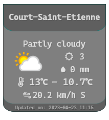

# Rainmeter-Ps-WeatherApi

A Rainmeter skin to display the weather using Powershell 7 and weatherapi.com

# Requirements

- Rainmeter: [link](https://www.rainmeter.net/)
- Powershell 7: `winget install -e Microsoft.Powershell`
- A weatherapi.com account/api-key (free plan): [weatherapi.com](www.weatherapi.com)
- JsonParser.dll in your Rainmeter Plugin folder: `in /src/JsonParser.dll` or from [GitHub](https://github.com/e2e8/rainmeter-jsonparser)
- Font installed: Caskaydia Cove Nerd Font [NerdFonts download site](https://www.nerdfonts.com/font-downloads)

# How-to install

1. Download .zip from release
2. Unzip downloaded file
3. Copy unzipped folder into your Rainmeter skins folder
4. Refresh Rainmeter
5. Modify `@Resources/scripts/ApiWeather.ps1` values of `$apiKey` and `$locGeoCoords`
6. Load Weather.ini

# Possible problems

|Error|Reason|
|--|--|
|Only `dummy` data shown |`$apiKey` or `$locGeoCoords` not correct in `@Resources/scripts/ApiWeather.ps1`|
|No icons in front of values |Caskaydia Cove Nerd Font not installed [How-to install fonts](https://www.howtogeek.com/787939/how-to-install-fonts-on-windows-10/)|
